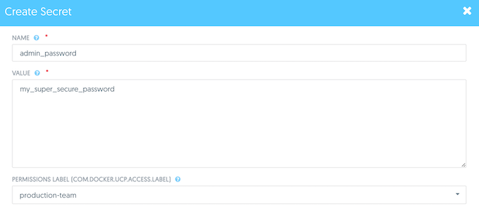
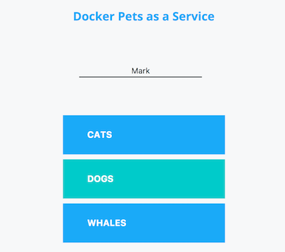
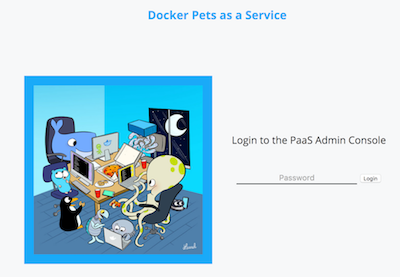
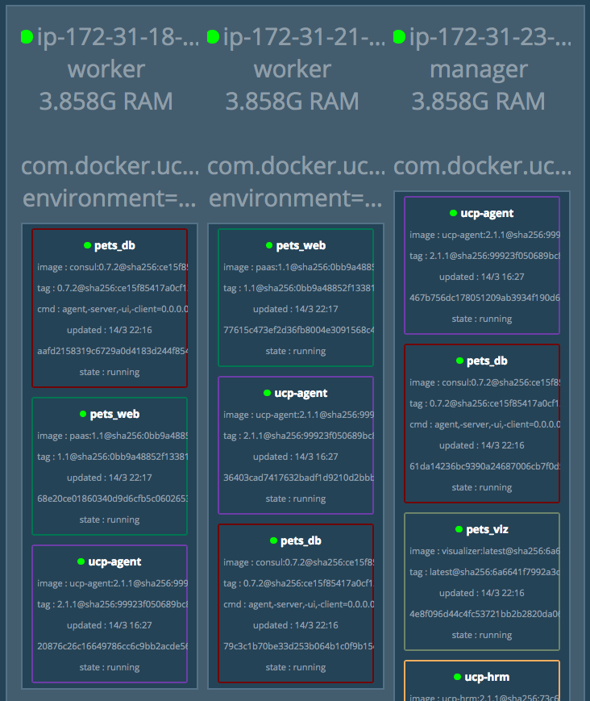
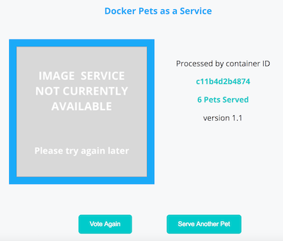

# Docker Universal Control Plane Demo Tutorial
> written for [Docker Pets as a Service v1.1](https://github.com/mark-church/docker-paas)

This is a tutorial for demoing Docker Universal Control Plane using the Docker PaaS application. 

#### Environment Requirements
- Docker Engine 17.03 EE
- UCP 2.1.x
- Minimum 2x hosts
- 2x DNS names for pets.* and admin.pets.*
- Ports open for app

#### Configuring Secrets
- PaaS uses a secret to access the Admin Console so that votes can be viewed. Before we deploy Paas, the UCP administrator has to create a secret in UCP.  Adjust the [pets-prod-compose.yml](https://github.com/mark-church/docker-paas/blob/master/pets-prod-compose.yml) file so that it matches the name of your secret. The environment variable `ADMIN_PASSWORD_FILE` must match the location and name of your secret. The default in the compose file is `ADMIN_PASSWORD_FILE=/run/secrets/admin_password` if your secret is named `admin_password`. Use whatever secret you like. If your secret is named `mysecret` then the value of `ADMIN_PASSWORD_FILE` would be `/run/secrets/mysecret`.

#### Configuring HRM
- Configure the `pets-prod-compose.yml` with the correct HTTP Routing URLs. Replace `<pets-ip>` and `<admin-console-ip>` with the values `pets.app<team>.dac.dckr.org` and `admin.app<team>.dac.dckr.org`. Replace `<team>` with your team.

 

#### Deploying with Compose
- Now deploy the application with your compose file, [pets-prod-compose.yml](https://github.com/mark-church/docker-paas/blob/master/pets-prod-compose.yml) in UCP as a Docker stack.

- Check the stack's service status and the logs for the `web` service. It will take up to 30 seconds for the app to become operational. Try going to one of the ports or URLs that the app is running on. You will see the event in the `web` service.

 

#### Load Balancing 
- If DNS and HRM (L7 load balancing) are configured correctly you can access on the configured URL or the ephemeral port chosen by UCP. You can set your `/etc/hosts` file to provide the resolution for the URL set in the compose file.

 

- Access the PaaS client page. Input your name and vote for a specific animal.

 

- Reload the page to serve new animals by pressing `Serve Another Pet`. See that you are being load balanced between multiple containers. The container ID will switch between the number of container in the `web` service, illustrating the Docker Routing Mesh.

- Feel free to hit `Vote Again` if you wish to change your vote.

 

- Log in to the admin console using the URL or port exposed by UCP. Use the secret password specified in Step 1.

 

- Now view the votes!

 

#### Sticky Sessions
- You may have noticed that the voting page load balances across the web container IDs. When you go to the Admin console, you will notice that the container ID presented is the same every time. That is because UCP is using the `sticky_sessions` option of the L7 load balancer. 

- Try going to the port that is exposed by the Admin Console. The port can be found in the UCP GUI when clicking on the `web` service. Go to this port log in with your secret. Refresh the Admin Console page couple times and you should see the container ID changing. This is because you are accessing it through the L4 port which does not have `sticky_sessions` enabled.

#### Scaling and Deploying Application Instances
- View how the application has been scheduled across nodes with the "Swarm Visualizer." It's running as the `pets-viz` container and you can see what port it's exposed on in the UCP GUI.

 

- Scale the application by changing the replicas parameter for the `paas_web` service to `6`. In `pets-viz` we can see additional nodes get scheduled. Back in the application you can see that `Serve Another Pet` is now load balancing you to more containers.

 

- Now initiate a rolling deployment. For the `pets_web` service change the following paramaters and click `Save Changes`
   - Image `chrch/paas:1.1-broken`
   - Update Parallelism `1`
   - Update Delay `5`
   - Failure Action `Pause`
   - Max Failure Ratio `0.2` (20%)

- Look at the visualizer and you will see that the health checks never pass for this image. Watch for up to 30 seconds. Now go back to the UCP GUI and click on `pets_web`. You will see that the rollout has been paused because the rollout has passed the failure threshold of 20%. Now initiate a rolling deployment again, but this time use the image `chrch/paas:1.1b`

 

#### Managing the Application Lifecycle
- Check that the application health check is working by going to `/health`. This health check endpoint is advertising the health of the application. UCP uses this health metric to manage the lifecycle of services and will kill and reschedule applications that have been unhealthy.

- Toggle the health check to be unhealthy by going to `/kill`. This URL will make the `/health` endpoint of one of the `web` containers return `unhealthy`. Now return to the web browser to see that one of the containers has toggled to unhealthy. Continue to refresh and see what happens. The container will be killed and rescheduled by Swarm automatically. It will be replaced by a new `web` container.

 

- Now go to one of your worker nodes and kill the worker engine with `sudo service docker stop`. In the swarm visualizer you will see the node dissappear and the engines will be rescheduled on the remaining nodes.

